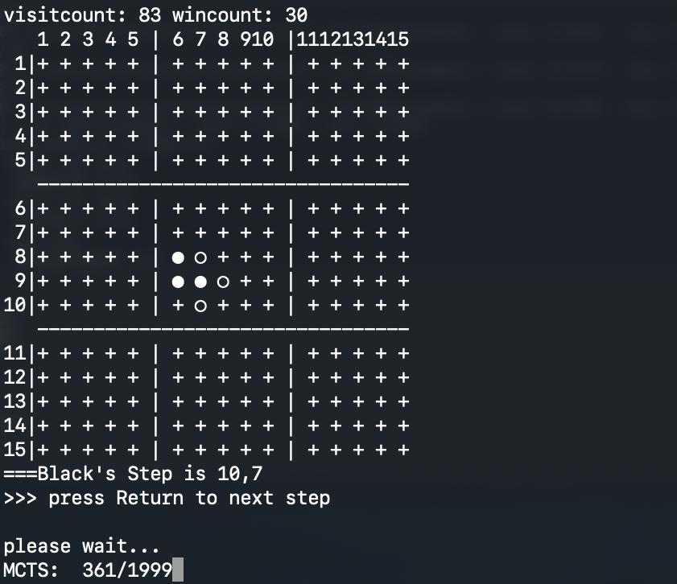

# Gobang
 use Alpha-Beta Pruning, PVS and Monte Carol Tree Search algorithm with C++

```shell
g++ -std=c++11 main.cpp AlphaBeta.cpp MCTS.cpp -o out

./out
```

### Screenshot



### Select Search Algorithm

main.cpp

```c++
//Select Search Algorithm
pair<int, int> SearchBestStep(const Gobang *s, int depth) {
    bestStep = make_pair(-1, -1);
    Gobang unrealboard = *s;
//    NegaMax(&unrealboard, depth);
//    AlphaBeta(&unrealboard, depth, MINNUM, MAXNUM);
//    AspirationSearch(&unrealboard, depth, MINNUM, MAXNUM);
//    PrincipalVariationSearch(&unrealboard, depth, MINNUM, MAXNUM);
    bestStep = MCTS(&unrealboard);
    return bestStep;
}
```


